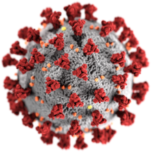

# Track CVID
  
> A COVID tracking website helping users to get the current number of COVID cases and past results.

## Table of Contents
* [General Info](#general-information)
* [Technologies Used](#technologies-used)
* [Features](#features)
* [Setup](#setup)
* [Usage](#usage)
* [Acknowledgements](#Acknowledgements)
* [License](#License)
<!-- * [License](#license) -->

## General Information
- A COVID tracking website displaying the total number of active cases, recovered patients and all total deaths due to COVID
- A worldwide map highlighting the country stats and encircling the positions according to the country covid stats
- The total no. of active COVID cases is being displayed in a table.
- The total no. of new cases since the past year on every month has been plotted on a graph.
- This website will provide current worldwide COVID stats in a user friendly way.
<!-- You don't have to answer all the questions - just the ones relevant to your project. -->

## Technologies Used
  
- react - 16.13.1
- material ui - 4.11.0
- chartjs - 2.9.3

## Features
The website uses APi to display the current COVID stats-
- The total number of current active cases, recovered patients and total number of deaths.
- A worldwide map highlighting the country stats and encircling the positions according to the country covid stats
- The total number active COVID cases is being displayed in a table.
- Graph of new cases since the past year on every month.

## Setup
Download the code, type the following code in your commandshell:
`npm start`
Visit `localhost:300` on your preffered browser and watch the website and edit in your own way

## Acknowledgements
- Used API - [disease.sh](https://disease.sh/)
- This project is made to share the current statistics of COVID.
- Many thanks to [API repo](https://github.com/disease-sh/api)

## License
This project is licensed under the MIT License - see the LICENSE.md file for details.
